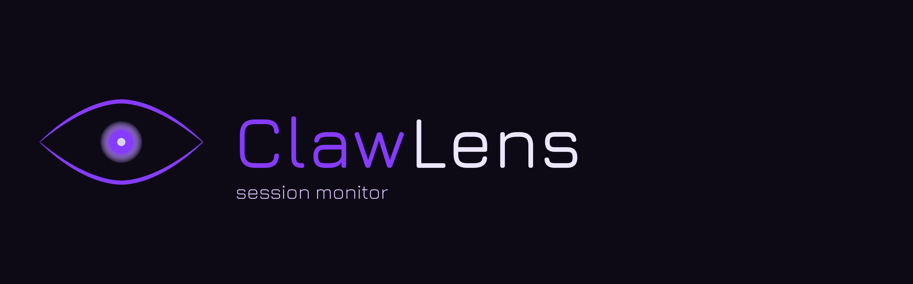
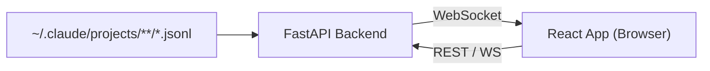

<p align="center">
  
</p>

<p align="center">
  Real-time dashboard for monitoring Claude Code sessions
</p>

<p align="center">
  <a href="#features">Features</a> &middot;
  <a href="#quick-start">Quick Start</a> &middot;
  <a href="#development">Development</a> &middot;
  <a href="#how-it-works">How It Works</a>
</p>

---

ClawView reads the JSONL session files that Claude Code writes to `~/.claude/projects/` and presents them in a live-updating web dashboard. Track token usage, costs, tool invocations, errors, and more across all your coding sessions.

## Features

- **Live session monitoring** -- active sessions update in real time via WebSocket
- **Project-level analytics** -- token usage over time, daily costs, model breakdown, tool usage trends
- **Session deep-dive** -- conversation timeline with turn-by-turn token counts, tool calls, and context window usage
- **Cost tracking** -- per-session and per-project cost estimates based on model pricing
- **Tool & MCP tracking** -- see which tools and MCP servers each session uses, with category breakdowns
- **Error & interruption rates** -- spot problematic sessions at a glance
- **Memory & skill browser** -- inspect memory files and sub-agent skills from within the dashboard
- **Continuation chain linking** -- follows `/clear` continuations across sessions
- **IDE integration** -- links to open files directly in your editor

## Quick Start

```bash
uvx clawview
```

That's it. Open **http://localhost:3333** in your browser.

> Requires [uv](https://docs.astral.sh/uv/) (install: `curl -LsSf https://astral.sh/uv/install.sh | sh`)

### From source

```bash
git clone https://github.com/tuongaz/clawview.git
cd clawview
make run
```

This requires Python 3.11+, [uv](https://docs.astral.sh/uv/), and [Bun](https://bun.sh/).

## Development

Run the frontend and backend separately for hot-reload:

```bash
# Terminal 1 -- Frontend (Vite dev server with HMR)
cd frontend && bun run dev

# Terminal 2 -- Backend
uv run clawview
```

### Other commands

```bash
make build          # Build frontend + sync Python deps
make clean          # Remove web/dist, frontend/node_modules, .venv
uv run pytest       # Run tests
uv run pyright src/clawview/  # Type checking
```

## How It Works

ClawView is a Python (FastAPI) backend that serves a React (Vite) frontend as static files.



The backend watches Claude Code's session files, parses JSONL entries into structured data (sessions, turns, tool events), computes analytics, and pushes updates to connected clients over multiple WebSocket channels.

### Tech stack

| Layer    | Technology |
|----------|------------|
| Backend  | Python, FastAPI, Uvicorn, WebSockets |
| Frontend | React 19, TypeScript, Vite, Tailwind CSS, HeroUI |
| Charts   | Recharts |
| Package  | uv (Python), Bun (JS) |

## License

MIT
